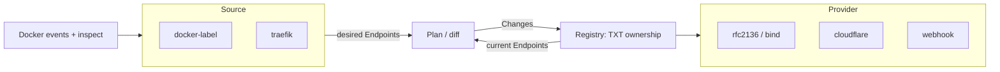

# Architecture

munpae adopts external-dns' proven model, adapted to plain Docker. Five pieces:

- **Endpoint** — the unit of desired/observed state: a DNS name, its targets
  (RDATA), a record type, a TTL, and free-form labels.
- **Source** — produces desired endpoints from the environment (Docker labels,
  Traefik rules). See [Sources](sources.md).
- **Provider** — reads and writes records in an actual DNS backend. See
  [Providers](providers.md).
- **Registry** — an ownership layer over a provider: it marks records munpae
  created so foreign records are never mutated.
- **Plan** — diffs desired (sources) against current (registry) into a set of
  changes.



## The Endpoint

```
DNSName    app.example.com        fully-qualified
Targets    [192.0.2.1]            RDATA: IPs (A/AAAA) or hostnames (CNAME)
RecordType A | AAAA | CNAME | TXT inferred from the target if not set
TTL        0                      0 = provider default
Labels     {…}                    ownership / provider-specific metadata
```

Record type is inferred from the first target — IPv4 → `A`, IPv6 → `AAAA`,
otherwise `CNAME` — matching external-dns' `target` semantics.

## The reconcile loop

munpae subscribes to Docker container `start`/`die`/`destroy` events, debounces
bursts (`MUNPAE_DEBOUNCE_DELAY`), and also reconciles on a timer
(`MUNPAE_RESYNC_INTERVAL`) as a safety net. Each reconcile:

1. **collect** — every source's `Endpoints()` is gathered and the default
   target / domain filter applied.
2. **read** — the registry returns the records munpae currently owns.
3. **diff** — `plan.Calculate` compares desired vs. current, honouring the
   [policy](usage.md#delete-vs-keep-policy) (`upsert-only` vs `sync`).
4. **apply** — the registry writes the record changes plus their ownership TXTs
   (or logs them under `--dry-run`).

**Fail-safe:** a provider error is logged and the previous state stands — there
is no partial teardown. The next resync repairs drift.

## Ownership

The default `txt` registry is what makes automatic management safe. For every
record `N` of type `T` it manages, it writes a companion **TXT record** at
`<prefix><t>-N` (e.g. `munpae.a-app.example.com`) whose value carries
`heritage=munpae,munpae/owner=<owner-id>`.

On each reconcile munpae only considers records that have a matching ownership
TXT as *its own*. Records without one — or owned by a different `owner-id` — are
never updated or deleted. Consequences:

- Two munpae instances with **distinct `MUNPAE_OWNER_ID`** never fight over each
  other's records (see [multiple instances](usage.md#multiple-instances)).
- The type prefix (`a-`, `cname-`) keeps the TXT out of the way of a real CNAME
  at the same name.
- `MUNPAE_TXT_PREFIX` namespaces all ownership TXTs and **must stay stable** —
  changing it orphans the existing markers.

Set `MUNPAE_REGISTRY=noop` to disable ownership and manage every record in the
zone (only appropriate for a zone dedicated to munpae).

## Multi-value records

Records that share a name and type are merged into a single multi-target
endpoint when read, and the full record set is converged on write, so
round-robin / multi-value records reconcile correctly rather than churning.
